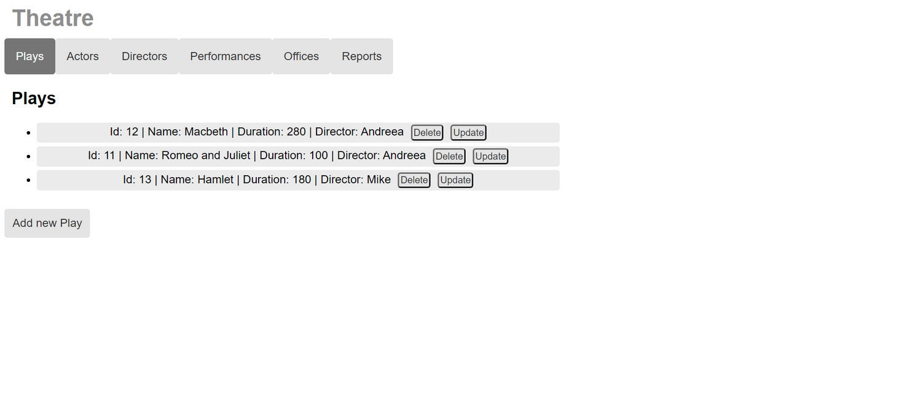
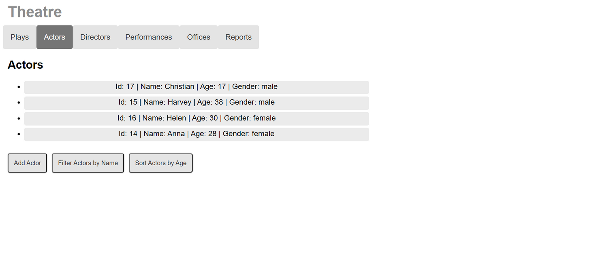
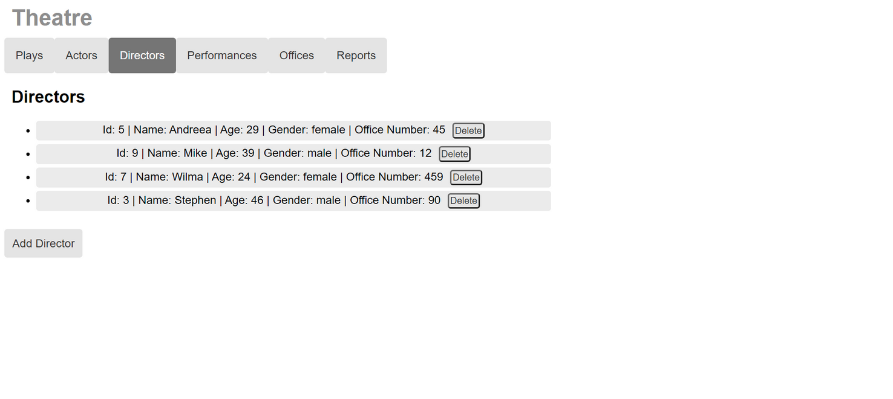
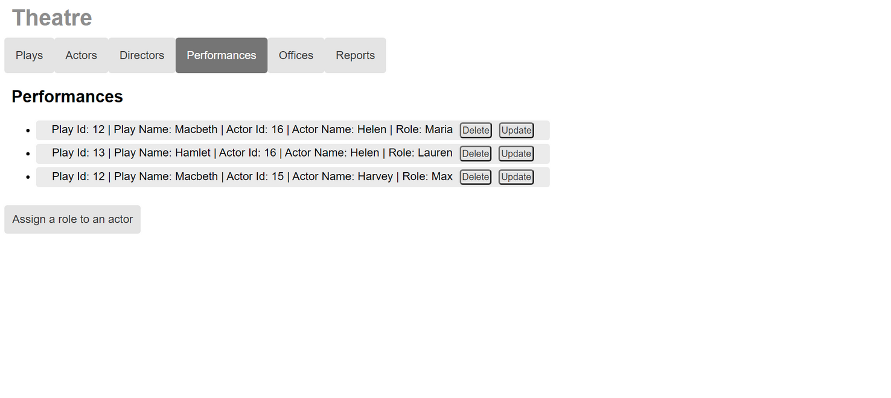
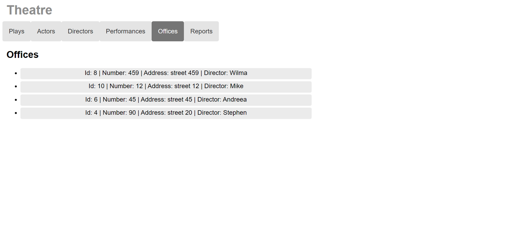
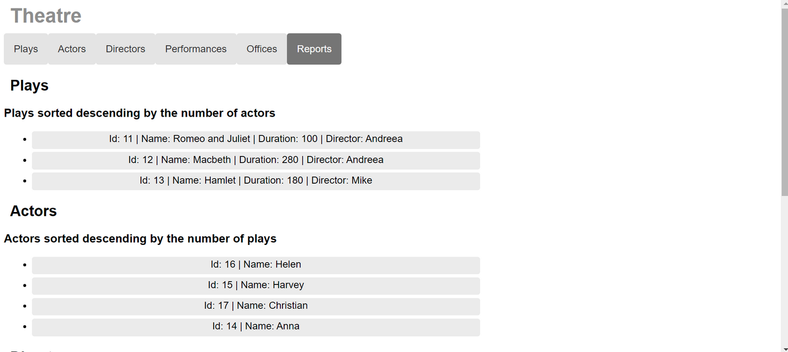
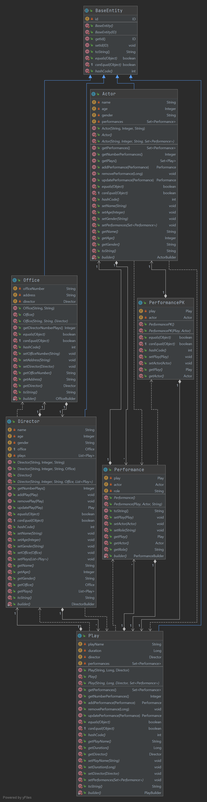

# Theatre Plays

This is a web application which manages theatre plays. From the menu bar at the top of the page, the user can choose to display the plays, actors, directors, performances, offices or reports of these categories.


## Application

### Plays

The user can add, update or delete a play.

### Actors

The user can add an actor or filter them by name or age.

### Directors

The user can add or delete a director.

### Performances

The user can add, update or delete a performance.

### Offices

The offices can be displayed.

### Reports

In the reports section, there are ranks for the previous categories.



## Class Diagram




## Running the application

1. Run the server
    1. Download Tomcat and configure the IDE in order to run the server using it
2. Run the Angular app
    1. run the following commands:
        1. ```cd webapp/```
        2. ```npm start```

The app will be running on http://localhost:4200


## Requirements

**Lab 10: Angular, Spring, JPA**

* project structure: core, web, webapp
* CRUD operations
* Filter, sort operations (client-side and server-side; on server-side, with Spring Data JPA)
* Use both reactive and template-driven forms and validate user input
* There should be four root entities and the requirements may be split over them, e.g., CRUD operations on entity1, client-side filters on entity2, server-side filters on entity3 etc

**Lab 11: Angular, Spring, JPA - mapping relationships**

* Implement relationships between entities; the fetch type will be eager 
* There should be at least four root entities and one repository per root aggregate; there should be no repository for the link entities (e.g. StudentDiscipline); there should be at least one relationship from each of the following: many-to-many, one-to-many, one-to-one (many-to-many may be implemented with two one-to-many associations; one-to-one may be implemented with embeddable)
* Operations on the link entity (e.g. enroll students to disciplines, assign/view/etc grades); reports/statistics

**Lab 12 (Final): handling the n + 1 select problem; testing**

* all associations must be lazily loaded
* after switching to Lazy fetching, check if the LazyInitializationException actually appears before trying to ‘handle' it (in SpringBoot some settings might be needed in this sense - otherwise everything is fetched eagerly)
* query the entities using: Spring Queries with Named Entity Graphs,  JPQL, Criteria API, Native SQL
* in each repository (e.g: BookRepository, ClientRepository etc) there should be _at least two methods_ using NamedEntityGraphs
* for each repository (e.g: BookRepository, ClientRepository etc), in the corresponding fragment/customized interface, there should be _at least two additional methods_; these  additional methods should have three different implementations with: JPQL, CriteriaAPI, NativeSql
* in the services only the 'main' repositories should be used (e.g: BookRepository and ClientRepository, not the fragment/customized ones)
* the application should work _alternatively_ with all of the following configurations: EntityGraphs + JPQL, EntityGraphs + CriteriaAPI, EntityGraphs + NativeSql. The configuration switch should be possible by changing annotations or property files, but not java code
* write integration tests for your repositories and services; use DbUnit, xml datasets 
* write unit tests for your controllers using Mockito 

